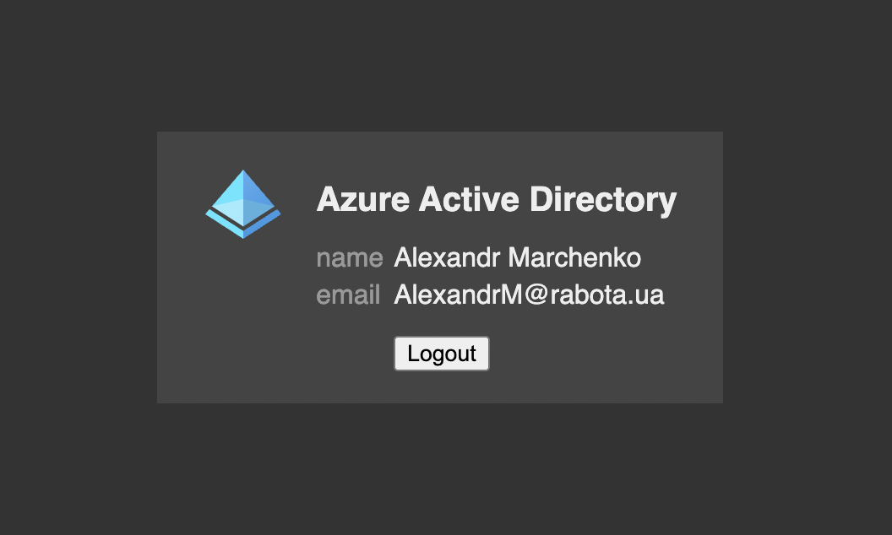

# Azure Active Directory Proxy

Covers any app with active directory authentication



## How does it work

You gonna need to [register an app](https://docs.microsoft.com/en-us/azure/active-directory/develop/quickstart-register-app) in your Azure Active Directory

After registration you will get most of the options required for proxy to run

Proxy itself does nothing fancy and works in conjunction with Kubernetes Ingress

Before passing request to your app, Ingress will check whether user is logged in or not by sending request to proxy `/check` endpoint and depending on its response it will pass request or redirect user to `/login` endpoint

Also there is ability to cache check results to avoid bazillion of requests to proxy

Here is an example of Ingress annotations that should be added to any service to protect it:

```yml
nginx.ingress.kubernetes.io/auth-url: "https://aad.mac-blog.org.ua/check"
nginx.ingress.kubernetes.io/auth-signin: "https://aad.mac-blog.org.ua/login"
nginx.ingress.kubernetes.io/auth-cache-key: $cookie_aad
```

Just not forget to replace your domain name, and replace `aad` with cookie name you have choosed to use

## Deployment

Here is an example of yaml definition of deployment:

```yml
# aad-proxy deployment, service and ingress
# availables at: https://aad.mac-blog.org.ua/
# endpoints: /         - home page will show if you are logged in or not
#            /login    - will redirect to azure login
#            /callback - handle login, verify tokens, extract claims, save cookie, redirect to app
#            /logout   - handle logout, removes cookie and redirect user to app
#            /check    - internal, used by ingress to decide whether user logged in or not
# usage:
# after applying aad-proxy just add following annotations to any ingress you wish to protect:
#
#   nginx.ingress.kubernetes.io/auth-url: "https://aad.mac-blog.org.ua/check"
#   nginx.ingress.kubernetes.io/auth-signin: "https://aad.mac-blog.org.ua/login"
#   nginx.ingress.kubernetes.io/auth-cache-key: $cookie_aad
---
apiVersion: apps/v1
kind: Deployment
metadata:
  name: aad-proxy
  labels:
    app: aad-proxy
spec:
  replicas: 1
  selector:
    matchLabels:
      app: aad-proxy
  template:
    metadata:
      labels:
        app: aad-proxy
    spec:
      containers:
        - name: aad-proxy
          image: mac2000/aad-proxy
          env:
            - name: AAD_CLIENT_ID
              value: xxxxxxxx-xxxx-xxxx-xxxx-xxxxxxxxxxxx
            - name: AAD_CLIEN_SECRET
              value: xxxxx~xxxxxxxxxxxxxxxxxxxxxxxxxxxxxx
            - name: AAD_TENANT_ID
              value: xxxxxxxX-xxxx-xxxx-xxxx-xxxxxxxxxxxx
            - name: AAD_CALLBACK_URL
              # domain name of aad-proxy
              value: https://aad.mac-blog.org.ua/callback
            - name: AAD_COOKIE_DOMAIN
              # put partent domain name here
              value: mac-blog.org.ua
            - name: AAD_COOKIE_NAME
              value: aad
          ports:
            - containerPort: 8080
---
apiVersion: v1
kind: Service
metadata:
  name: aad-proxy
spec:
  type: ClusterIP
  selector:
    app: aad-proxy
  ports:
    - name: aad-proxy
      protocol: TCP
      port: 80
      targetPort: 8080
---
apiVersion: networking.k8s.io/v1
kind: Ingress
metadata:
  name: aad-proxy
  annotations:
    # IMPORTANT - azure gives us really big cookies which wont fit into default ingress configs
    # -----------------------------------------------------------------------------------------
    # Fix for: WARNING: Multiple cookies are required for this session as it exceeds the 4kb cookie limit. Please use server side session storage (eg. Redis) instead.
    # Which leads to: Error redeeming code during OAuth2 callback: token exchange failed: oauth2: cannot fetch token: 400 Bad Request
    nginx.ingress.kubernetes.io/proxy-buffer-size: "8k"
    nginx.ingress.kubernetes.io/proxy-buffers-number: "4"
spec:
  rules:
    - host: aad.mac-blog.org.ua
      http:
        paths:
          - pathType: ImplementationSpecific
            path: /
            backend:
              service:
                name: aad-proxy
                port:
                  number: 80
```

## Application Example

Here is an example of protected application

```yml
---
apiVersion: apps/v1
kind: Deployment
metadata:
  name: app1
  labels:
    app: app1
spec:
  replicas: 1
  selector:
    matchLabels:
      app: app1
  template:
    metadata:
      labels:
        app: app1
    spec:
      containers:
        - name: app1
          image: nginx:alpine
          ports:
            - name: app1
              containerPort: 80
---
apiVersion: v1
kind: Service
metadata:
  name: app1
spec:
  type: ClusterIP
  selector:
    app: app1
  ports:
    - name: app1
      protocol: TCP
      port: 80
      targetPort: 80
---
apiVersion: networking.k8s.io/v1
kind: Ingress
metadata:
  name: app1
  annotations:
    # domain name of aad-proxy
    nginx.ingress.kubernetes.io/auth-url: "https://aad.mac-blog.org.ua/check"
    nginx.ingress.kubernetes.io/auth-signin: "https://aad.mac-blog.org.ua/login"
    # `$cookie_aad`, where `aad` is a cookie name passed via `AAD_COOKIE_NAME` env
    nginx.ingress.kubernetes.io/auth-cache-key: $cookie_aad
spec:
  rules:
    # domain of app that will be protected
    - host: app1.mac-blog.org.ua
      http:
        paths:
          - pathType: ImplementationSpecific
            path: /
            backend:
              service:
                name: app1
                port:
                  number: 80
```

After deploying both aad-proxy and app1, if you will try to open your app, you should be redirected to Azure loging page and after successfull login back to app

## Configuration options

All configuration options are required and passed as environment variables

| name | description |
| ---- | ----------- |
| `AAD_TENANT_ID` | tenant id |
| `AAD_CLIENT_ID` | client id |
| `AAD_CLIEN_SECRET` | client secret |
| `AAD_CALLBACK_URL` | URL where user will be redirected after login, in local setup it might be `http://localhost:8080/callback`, in production it should be something like `https://aad.contoso.com/callback`, make a note on `/callback` endpoint, it will handle all oauth2 dancing with tokens |
| `AAD_COOKIE_DOMAIN` | domain to which cookie will be set, for local setup it might be `localhost`, for production it should be parent domain, e.g. `contoso.com`, it is required for cookie to be "visible" on all subdomains |
| `AAD_COOKIE_NAME` | name of the cookie, something like `aad` will be fine |

**Optional headers options**

Underneath protected app will also receive set of headers identifying user, which can also be configured

| name | default | description |
| ---- | ------- | ----------- |
| `AAD_HEADER_ID` | `X-AAD-ID` | will contain token subject |
| `AAD_HEADER_NAME` | `X-AAD-NAME` | user full name |
| `AAD_HEADER_USERNAME` | `X-AAD-USERNAME` | username, extracted from email |
| `AAD_HEADER_EMAIL` | `X-AAD-EMAIL` | user email |
| `AAD_HEADER_ROLES` | `X-AAD-ROLES` | comma separated list of user roles |

**Optional role map**

Some apps, like Grafana, expecting single header with a single role, imagine that in our Azure application there are `Admins` and `Writers` roles, and we want to map them to Grafanas `Admin` and `Editor`, to do so, pass following parameters:


| name | default | description |
| ---- | ------- | ----------- |
| `AAD_HEADER_ROLE` | `X-AAD-ROLE` | header which will contain found role if any |
| `AAD_HEADER_ROLE_MAP` | `""` | comma separated list of role pair, aka: `Writers:Editor, Admins:Admin` |

Whenever proxy will receive request it will loop via all user roles trying to find desired role in map and will pass last found one as a role header

So in grafana you can use something like: `-e GF_AUTH_PROXY_HEADERS="Name:X-AAD-NAME Email:X-AAD-EMAIL Role:X-AAD-ROLE"` and any user who has `Writers` role will automatically receive `Editor` role in grafana

## Notes

Azure id_token example:

```json
{
  "aud": "xxxxxxxx-xxxx-xxxx-xxxx-xxxxxxxx",
  "iss": "https://sts.windows.net/xxxxxxxx-xxxx-xxxx-xxxx-xxxxxxxx/",
  "iat": 1638212393,
  "nbf": 1638212393,
  "exp": 1638216293,
  "amr": [
    "pwd",
    "mfa"
  ],
  "family_name": "Marchenko",
  "given_name": "Alexandr",
  "ipaddr": "168.140.34.181",
  "name": "Alexandr Marchenko",
  "nonce": "xxxxxxxxx",
  "oid": "xxxxxxxx-xxxx-xxxx-xxxx-xxxxxxxx",
  "onprem_sid": "S-1-5-21-xxxxxxxx-xxxxxxxx-xxxxxxxx-xxxx",
  "rh": "xxxxxxxxx",
  "roles": [
    "Writers"
  ],
  "sub": "xxxxxxxxx_xxxxxxxxxxxxxxxxxx",
  "tid": "xxxxxxxx-xxxx-xxxx-xxxx-xxxxxxxx",
  "unique_name": "AlexandrM@rabota.ua",
  "upn": "AlexandrM@rabota.ua",
  "uti": "xxxxxxxxx",
  "ver": "1.0"
}
```